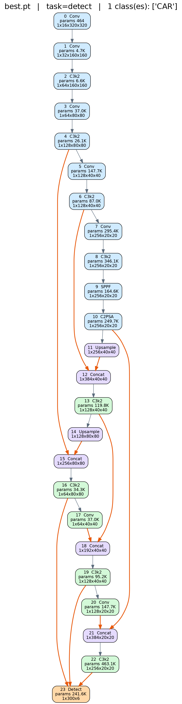
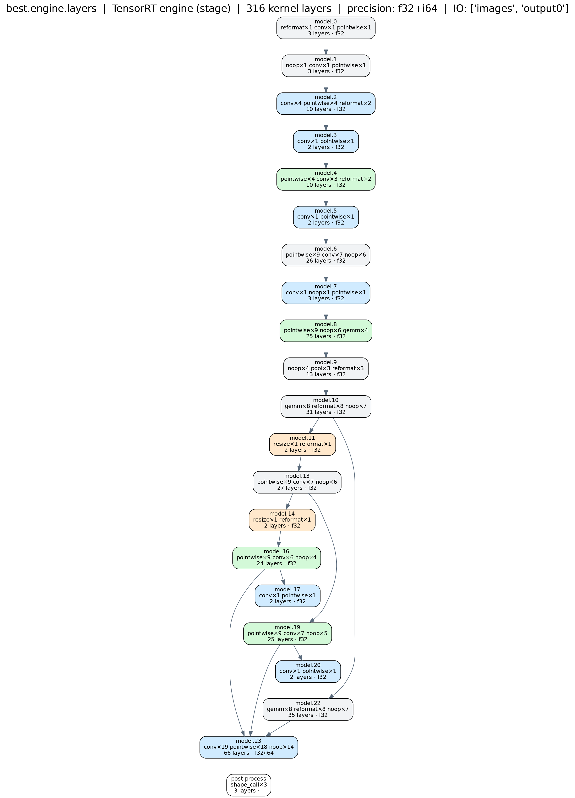

# yolo26_TensorRT

**YOLO26 nano 모델의 TensorRT 배포를 위한 repo.**

`model/best.pt`(YOLO11n 계열 detector, `task=detect`, 클래스 1개 `CAR`, 24 레이어,
약 2.5M 파라미터, in-repo 커스텀 ultralytics 포크 `yolo26/ultralytics` 로 학습)를
**`.pt` → ONNX → TensorRT 엔진**으로 변환하고, 엔진 추론/벤치마크를 수행하는 것을 목표로 한다.

## 환경 구축

```bash
conda create -n yolo python=3.10 -y && conda activate yolo
cd yolo26
pip install -r requirements.txt          # 의존성 + 커스텀 ultralytics 포크(-e .) 설치
sudo apt-get install -y graphviz         # visualize_model.py 그래프 렌더용(dot)
```

- `yolo26/requirements.txt` 하나로 배포 환경을 그대로 재현할 수 있다.
- `pip install -r requirements.txt` 는 마지막 줄 `-e .` 로 이 repo 의
  `yolo26/ultralytics` 포크를 `ultralytics` 패키지로 설치한다 → 어디서든 `import ultralytics` 가능.
- **TensorRT** (`tensorrt-cu12==10.7.0`) 도 `requirements.txt` 에 포함 — CUDA 12 + torch `cu121` 기준,
  NVIDIA GPU + 드라이버 필요. 다른 CUDA 면 `tensorrt-cu13` 등으로 교체. 엔진 빌드/추론이 필요 없으면
  이 줄만 빼면 된다 (`tensorrt-cu12-libs` 가 약 1GB).

## 디렉터리 구조

| 경로 | 내용 |
|---|---|
| `model/` | 가중치 (`best.pt`, `prune.pt` 등) 및 생성된 구조 그래프 |
| `dataset/`, `dataset.yaml` | 학습/검증/테스트 데이터셋 (Roboflow `crash_test`) |
| `yolo26/` | 커스텀 ultralytics 포크 + 학습/평가/프루닝 스크립트 |
| `TensorRT/` | **TensorRT 관련 파일 전용 폴더** (ONNX/엔진 변환, 엔진 추론, 벤치마크 등) |
| `assets/` | README 용 이미지 (구조 그래프 등) |

## 스크립트 설명

수정 시 이 표를 갱신한다. 각 코드 파일은 같은 이름의 `.md` 문서를 함께 둔다.

파이프라인 순서: **`ori_visualize_model.py` (원본 구조 확인) → `build_trt_engine.py` (.pt→ONNX→engine) → `TRT_visualize_model.py` (TRT 적용 후 구조 확인)**

| 파일 | 설명 |
|---|---|
| `TensorRT/ori_visualize_model.py` | **[원본 모델 그래프]** `model/best.pt` 레이어 구조를 Graphviz **세로** 방향 그래프(PNG/SVG/PDF)로 저장 → `model/ori_structure.png`. `net.model`(`nn.Sequential`) 순회로 레이어별 인덱스·입력연결(`from`)·타입·파라미터수 수집 + 더미입력 forward hook 으로 출력 shape 캡처 → DOT 렌더. backbone/neck-head/Concat·Upsample/Detect 색 구분, skip 연결 강조. `find_repo_root()` 로 어느 폴더에서 실행해도 동작. `conda activate yolo` 필요. 상세: [`TensorRT/ori_visualize_model.md`](TensorRT/ori_visualize_model.md) |
| `TensorRT/build_trt_engine.py` | `best.pt` → **ONNX** → **TensorRT 엔진(.engine)** 2단계 변환. [1] Ultralytics `export(format="onnx")`, [2] TensorRT Python API(`Builder`+`OnnxParser`)로 엔진 빌드 (FP16/INT8, workspace, 동적 batch profile, TRT 8/10 API 분기). 빌드 후 IO 텐서와 `<engine>.engine.layers.json`(fusion·정밀도 반영 레이어 정보) 덤프. `--skip-onnx`/`--skip-engine` 로 단계 분리. CUDA 디바이스 가드 포함(core dump 방지). 상세: [`TensorRT/build_trt_engine.md`](TensorRT/build_trt_engine.md) |
| `TensorRT/TRT_visualize_model.py` | **[TensorRT 적용 후 그래프]** `build_trt_engine.py` 가 덤프한 `best.engine.layers.json` 을 읽어 fusion·정밀도 반영된 실행 그래프를 **세로** 방향으로 렌더 → `model/TRT_structure.png`. `--level stage`(원본 `model.N` 단위 요약, 원본 그래프와 비교용) / `--level layer`(커널 레이어 전부). LayerType 계열 색 구분, FP16/INT8 테두리 강조. 텐서 이름당 생산자를 리스트로 관리(`producer_for()`)해 TRT 의 Concat fusion·myelin 텐서 이름 재사용에도 엣지가 **거꾸로(위로)** 안 이어지게 함. 상세: [`TensorRT/TRT_visualize_model.md`](TensorRT/TRT_visualize_model.md) |
| `TensorRT/TRT_layer_print.py` | **[레이어 이름 변화 — 터미널]** `best.engine.layers.json`(+`best.onnx`)에서 원본 ONNX 레이어가 TRT 커널로 오며 **어떻게 합쳐지고(fusion) 이름이 바뀌었는지** 를 stdout 으로. `[1]` 커널→ONNX, `[2]` ONNX→커널, `[3]` 상수폴딩으로 사라진 노드, 요약(keep/rename/fuse/new). `--json` 으로 대응표 저장. 상세: [`TensorRT/TRT_layer_print.md`](TensorRT/TRT_layer_print.md) |
| `TensorRT/compare_pt_trt.py` | **[`.pt` vs TensorRT 비교]** 원본 `best.pt` 의 24개 nn.Module 이 엔진에서 커널 몇 개로 바뀌었는지 `.pt` 기준으로 집계 → `model/pt_vs_trt.md`. 각 `model.N` 을 `레이어 수 (.pt→TRT)` = `내부 leaf 서브모듈 수 → TRT 커널 수` 로 표기. 커널 metadata `[ONNX Layer: /model.N/…]` 로 매칭 (ONNX 파일은 안 읽음). `--onnx` 를 명시하면 가운데에 ONNX 노드 수도 추가(참고용, 기본 꺼짐). `conda activate yolo` 필요. 상세: [`TensorRT/compare_pt_trt.md`](TensorRT/compare_pt_trt.md) |

## 모델 구조: 원본 vs TensorRT

`ori_visualize_model.py` 와 `TRT_visualize_model.py` 의 출력 (둘 다 세로 방향).
왼쪽은 원본 `best.pt` 의 24개 레이어, 오른쪽은 TensorRT 엔진이 fusion·정밀도 적용을
끝낸 뒤의 구조를 원본 `model.N` 단계 단위로 묶은 것 (FP32 엔진 기준).

<table>
<tr>
<th>원본 (<code>best.pt</code> · 24 layers · 2.5M params)</th>
<th>TensorRT engine (stage · 316 kernel layers · FP32)</th>
</tr>
<tr>
<td valign="top" align="center"></td>
<td valign="top" align="center"></td>
</tr>
</table>

> 이미지를 클릭하면 원본 해상도로 볼 수 있다. 커널 단위 전체 그래프는
> `python TensorRT/TRT_visualize_model.py --level layer` 로 별도 생성.
