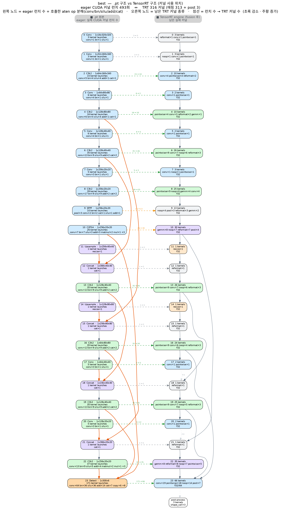

# yolo26_TensorRT

**YOLO26 nano 모델의 TensorRT 배포를 위한 repo.**

`model/best.pt`(**YOLO26 nano** detector, `task=detect`, 클래스 1개 `CAR`, 24 레이어,
약 2.5M 파라미터, in-repo 커스텀 ultralytics 포크 `yolo26/ultralytics` 로 학습)를
**`.pt` → ONNX → TensorRT 엔진**으로 변환하고, 엔진 추론/벤치마크를 수행하는 것을 목표로 한다.

## 환경 구축

```bash
conda create -n yolo python=3.10 -y && conda activate yolo
cd yolo26
pip install -r requirements.txt          # 의존성 + 커스텀 ultralytics 포크(-e .) 설치
sudo apt-get install -y graphviz         # visualize_model.py 그래프 렌더용(dot)
```

- `yolo26/requirements.txt` 하나로 배포 환경을 그대로 재현할 수 있다.
- `pip install -r requirements.txt` 는 마지막 줄 `-e .` 로 이 repo 의
  `yolo26/ultralytics` 포크를 `ultralytics` 패키지로 설치한다 → 어디서든 `import ultralytics` 가능.
- **TensorRT** (`tensorrt-cu12==10.7.0`) 도 `requirements.txt` 에 포함 — CUDA 12 + torch `cu121` 기준,
  NVIDIA GPU + 드라이버 필요. 다른 CUDA 면 `tensorrt-cu13` 등으로 교체. 엔진 빌드/추론이 필요 없으면
  이 줄만 빼면 된다 (`tensorrt-cu12-libs` 가 약 1GB).

## 디렉터리 구조

| 경로 | 내용 |
|---|---|
| `model/` | 가중치 (`best.pt`, `prune.pt` 등) 및 생성된 구조 그래프 |
| `dataset/`, `dataset.yaml` | 학습/검증/테스트 데이터셋 (Roboflow `crash_test`) |
| `yolo26/` | 커스텀 ultralytics 포크 + 학습/평가/프루닝 스크립트 |
| `TensorRT/` | **TensorRT 관련 파일 전용 폴더** (ONNX/엔진 변환, 엔진 추론, 벤치마크 등) |
| `assets/` | README 용 이미지 (구조 그래프 등) |

## 스크립트 설명

수정 시 이 목록을 갱신한다. 각 코드 파일은 같은 이름의 `.md` 문서를 함께 둔다.
아래 각 항목은 **클릭하면 펼쳐진다.**

파이프라인 순서: **`ori_visualize_model.py` (원본 구조) → `build_trt_engine.py` (.pt→ONNX→engine) → `TRT_visualize_model.py` (TRT 후 구조)**  ·  구조 비교: `TRT_layer_print.py` / `compare_pt_trt.py` / `kernel_compare.py`  ·  정확도·속도 비교: `yolo26/eval.py`

<details>
<summary><b><code>TensorRT/ori_visualize_model.py</code></b> — [원본 모델 그래프] best.pt 레이어 구조 → 세로 그래프</summary>

<br>

`model/best.pt` 레이어 구조를 Graphviz **세로** 방향 그래프(PNG/SVG/PDF)로 저장 → `model/ori_structure.png`.
`net.model`(`nn.Sequential`) 순회로 레이어별 인덱스·입력연결(`from`)·타입·파라미터수 수집 + 더미입력 forward hook 으로 출력 shape 캡처 → DOT 렌더.
backbone/neck-head/Concat·Upsample/Detect 색 구분, skip 연결 강조. `find_repo_root()` 로 어느 폴더에서 실행해도 동작. `conda activate yolo` 필요.

상세: [`TensorRT/ori_visualize_model.md`](TensorRT/ori_visualize_model.md)

</details>

<details>
<summary><b><code>TensorRT/build_trt_engine.py</code></b> — best.pt → ONNX → TensorRT 엔진(.engine) 2단계 변환</summary>

<br>

`best.pt` → **ONNX** → **TensorRT 엔진(.engine)** 2단계 변환.
[1] Ultralytics `export(format="onnx")`, [2] TensorRT Python API(`Builder`+`OnnxParser`)로 엔진 빌드 (FP16/INT8, workspace, 동적 batch profile, TRT 8/10 API 분기).
`--fp16` 이면 출력이 `model/best_fp16.engine` (`--int8` → `best_int8.engine`)로 나와 FP32 엔진을 덮어쓰지 않는다. `--engine` 을 직접 주면 그 경로를 그대로 쓴다.
빌드 후 IO 텐서와 `<engine>.engine.layers.json`(fusion·정밀도 반영 레이어 정보) 덤프. `--skip-onnx`/`--skip-engine` 로 단계 분리. CUDA 디바이스 가드 포함(core dump 방지).

상세: [`TensorRT/build_trt_engine.md`](TensorRT/build_trt_engine.md)

</details>

<details>
<summary><b><code>TensorRT/TRT_visualize_model.py</code></b> — [TensorRT 적용 후 그래프] 엔진 실행 그래프 → 세로 그래프</summary>

<br>

`build_trt_engine.py` 가 덤프한 `best.engine.layers.json` 을 읽어 fusion·정밀도 반영된 실행 그래프를 **세로** 방향으로 렌더 → `model/TRT_structure.png`.
`--level stage`(원본 `model.N` 단위 요약, 원본 그래프와 비교용) / `--level layer`(커널 레이어 전부). LayerType 계열 색 구분, FP16/INT8 테두리 강조.
텐서 이름당 생산자를 리스트로 관리(`producer_for()`)해 TRT 의 Concat fusion·myelin 텐서 이름 재사용에도 엣지가 **거꾸로(위로)** 안 이어지게 함.

상세: [`TensorRT/TRT_visualize_model.md`](TensorRT/TRT_visualize_model.md)

</details>

<details>
<summary><b><code>TensorRT/TRT_layer_print.py</code></b> — [레이어 이름 변화 — 터미널] ONNX ↔ TRT 커널 fusion/rename</summary>

<br>

`best.engine.layers.json`(+`best.onnx`)에서 원본 ONNX 레이어가 TRT 커널로 오며 **어떻게 합쳐지고(fusion) 이름이 바뀌었는지** 를 stdout 으로.
`[1]` 커널→ONNX, `[2]` ONNX→커널, `[3]` 상수폴딩으로 사라진 노드, 요약(keep/rename/fuse/new). `--json` 으로 대응표 저장.

상세: [`TensorRT/TRT_layer_print.md`](TensorRT/TRT_layer_print.md)

</details>

<details>
<summary><b><code>TensorRT/compare_pt_trt.py</code></b> — [.pt vs TensorRT — 표] 모듈마다 커널 몇 개로 바뀌었나 → pt_vs_trt.md</summary>

<br>

원본 `best.pt` 의 24개 nn.Module 이 엔진에서 커널 몇 개로 바뀌었는지 `.pt` 기준으로 집계 → `pt_vs_trt.md` (repo 루트).
각 `model.N` 을 `레이어 수 (.pt→TRT)` = `내부 leaf 서브모듈 수 → TRT 커널 수` 로 표기. 커널 metadata `[ONNX Layer: /model.N/…]` 로 매칭 (ONNX 파일은 안 읽음).
`--onnx` 를 명시하면 가운데에 ONNX 노드 수도 추가(참고용, 기본 꺼짐). `conda activate yolo` 필요.
`--engine-json model/best_fp16.engine.layers.json --out pt_vs_trt_fp16.md` 로 FP16 엔진 판도 생성 → [`pt_vs_trt_fp16.md`](pt_vs_trt_fp16.md).

산출물: [`pt_vs_trt.md`](pt_vs_trt.md) (FP32) · [`pt_vs_trt_fp16.md`](pt_vs_trt_fp16.md) (FP16) · 상세: [`TensorRT/compare_pt_trt.md`](TensorRT/compare_pt_trt.md)

</details>

<details>
<summary><b><code>TensorRT/kernel_compare.py</code></b> — [.pt vs TensorRT — 그래프] 구조를 좌우에 나란히 → kernel_compare.png</summary>

<br>

`.pt` 구조와 TRT 구조를 같은 `model.N` 축으로 **좌우에 나란히** 그린 한 장의 이미지 → `model/kernel_compare.png`.
왼쪽 노드 = eager 실행 시 **실제 CUDA 커널 런치 수**(`torch.profiler` 로 `cudaLaunchKernel` 카운트, warmup 후) + 연산 종류, 오른쪽 노드 = 남은 TRT 커널 수·종류(`conv/gemm/pointwise/reformat…`)·정밀도, 가운데 점선 = `런치 수 → 커널 수`(초록 감소/주황 증가), 각 컬럼 안에 체인+skip 구조.
이 모델 기준 **493 → 316 (−180)**. BN fold·SiLU 분해·reformat 삽입이 한눈에. CUDA 없으면 `--no-profile` 로 leaf 어림값. `conda activate yolo` + Graphviz 필요.

상세: [`TensorRT/kernel_compare.md`](TensorRT/kernel_compare.md)

</details>

<details>
<summary><b><code>yolo26/eval.py</code></b> — [.pt vs TensorRT — 정확도/속도] 같은 데이터셋으로 val → eval_pt_vs_trt.md</summary>

<br>

원본 `model/best.pt` 와 **이미 빌드된** 엔진 `model/best.engine` 을 같은 데이터셋 split
(기본 `test`) · **batch=1** 로 Ultralytics `val` 돌려 정확도(mAP50-95/50/75·P·R)와
속도(preprocess/inference/postprocess ms)를 나란히 비교 → `eval_pt_vs_trt.md` (repo 루트).
엔진은 **재변환하지 않고** 그대로 로드한다 (엔진 새로 만들 땐 `build_trt_engine.py`).
정적 batch=1 엔진이라 batch 는 1 고정. val 산출물은 `runs/eval/{pt,trt}/`.
`--engine model/best_fp16.engine` 로 FP16 엔진도 같은 방식으로 비교.
이 repo 기준 정확도 거의 동일(mAP50-95 −1.5%p 이내)·추론 FP32 2.4× / FP16 5.2× 빠름. `conda activate yolo` 필요.

상세: [`yolo26/eval.md`](yolo26/eval.md)

</details>

## 모델 구조: 원본 vs TensorRT

`ori_visualize_model.py` 와 `TRT_visualize_model.py` 의 출력 (둘 다 세로 방향).
왼쪽은 원본 `best.pt` 의 24개 레이어, 오른쪽은 TensorRT 엔진이 fusion·정밀도 적용을
끝낸 뒤의 구조를 원본 `model.N` 단계 단위로 묶은 것.
단계별 커널 수 표: [`pt_vs_trt.md`](pt_vs_trt.md) (FP32 엔진 · 316 커널) · [`pt_vs_trt_fp16.md`](pt_vs_trt_fp16.md) (FP16 엔진 · 221 커널, SiLU 가 conv 로 더 fused 됨).

<table>
<tr>
<th>원본 (<code>best.pt</code> · 24 layers · 2.5M params)</th>
<th>TensorRT engine (stage · 316 kernel layers · FP32)</th>
</tr>
<tr>
<td valign="top" align="center"></td>
<td valign="top" align="center"></td>
</tr>
</table>

> 이미지를 클릭하면 원본 해상도로 볼 수 있다. 커널 단위 전체 그래프는
> `python TensorRT/TRT_visualize_model.py --level layer` 로 별도 생성.

### 커널 사용 위치 좌우 비교 (`kernel_compare.py`)

`.pt` 가 어디서 커널을 호출하는지와 TensorRT fusion 후 실제 커널이 어디서 도는지를
같은 `model.N` 축으로 나란히. 왼쪽 노드 = eager 실행 시 **실제 CUDA 커널 런치 수**
(`torch.profiler` 로 `cudaLaunchKernel` 카운트) + 연산 종류, 오른쪽 노드 = 남은 TRT
커널 수·종류(`conv/gemm/pointwise/reformat…`)·정밀도, 가운데 점선 = `런치 수 → 커널 수`
(**초록 감소 · 주황 증가**).

<p align="center"></p>

> **eager 493회 호출 → TRT 316 커널 (−180, 감소).** `Detect` 는 `171 → 66`.
> 늘어난 건 `model.9`(SPPF)·`model.10`(C2PSA) 둘뿐 — 값싼 레이아웃 변환 커널(`reformat`/`noop`) 삽입.
> `BN` 은 conv 에 fold 되어 사라지고, `SiLU` 는 적용마다 `pointwise` 커널로 나뉜다.
> 생성: `python TensorRT/kernel_compare.py` (CUDA 없으면 leaf 어림값)

## 정확도·속도: 원본 `best.pt` vs TRT FP32 vs TRT FP16

`yolo26/eval.py` 로 원본 `model/best.pt` 와 두 엔진(`best.engine` FP32, `best_fp16.engine` FP16)을
같은 데이터셋 split(`test`) · **batch=1** · imgsz=640 으로 Ultralytics `val` 돌린 결과. (생성일 2026-09-09)

### 정확도 (괄호 = 원본 대비 Δ)

| 지표 | 원본 `best.pt` | TRT FP32 | TRT FP16 |
|---|--:|--:|--:|
| mAP50-95 | 0.8534 | 0.8399 (−0.0135) | 0.8410 (−0.0124) |
| mAP50 | 0.9810 | 0.9827 (+0.0016) | 0.9827 (+0.0016) |
| mAP75 | 0.9582 | 0.9440 (−0.0141) | 0.9406 (−0.0175) |
| Precision | 0.9943 | 0.9592 (−0.0351) | 0.9634 (−0.0309) |
| Recall | 0.9271 | 0.9799 (+0.0528) | 0.9792 (+0.0521) |

### 속도 (이미지당)

| 구성 | 추론 ms | 합계 ms | 엔진 크기 | `.pt` 대비 배속 (추론 / 합계) |
|---|--:|--:|--:|--:|
| 원본 `best.pt` | ~7–8 | ~7.7–8.9 | 5.2 MB (`.pt`) | 1.00× / 1.00× |
| TRT FP32 (`best.engine`) | 3.02 | 3.66 | ~15 MB | **2.40× / 2.11×** |
| TRT FP16 (`best_fp16.engine`) | 1.60 | 2.21 | ~8.2 MB | **5.24× / 4.05×** |

> **정확도**: FP32·FP16 둘 다 원본과 사실상 동일 (mAP50-95 −1.5%p 이내). FP16 이 오히려 FP32 엔진보다 mAP50-95 가 근소하게 높다(둘 다 오차 범위). P↓ / R↑ 는 커널 fusion·연산 순서로 confidence 분포가 미세하게 달라져 생기며 mAP 총합은 유지된다.
> **속도**: FP16 이 추론 **5.2×** / 전체 **4.0×** 빠르고, 엔진끼리 비교해도 FP16 이 FP32 보다 추론 **1.9× 빠름** (3.02 → 1.60 ms). 가중치가 반정밀이라 엔진 크기도 절반, fusion 이 더 적극적이라 커널 수도 316 → 221.
> 배속은 각 엔진을 잰 **같은 `eval.py` 실행의 `.pt` 기준** 비율이다 (`.pt` 추론 절대값은 실행마다 7~8 ms 로 흔들려 절대 ms 를 직접 빼면 안 됨).
> 상세: [`eval_pt_vs_trt.md`](eval_pt_vs_trt.md) (FP32) · [`eval_pt_vs_trt_fp16.md`](eval_pt_vs_trt_fp16.md) (FP16)
> 재현: `python yolo26/eval.py` · `python yolo26/eval.py --engine model/best_fp16.engine --out eval_pt_vs_trt_fp16.md`
